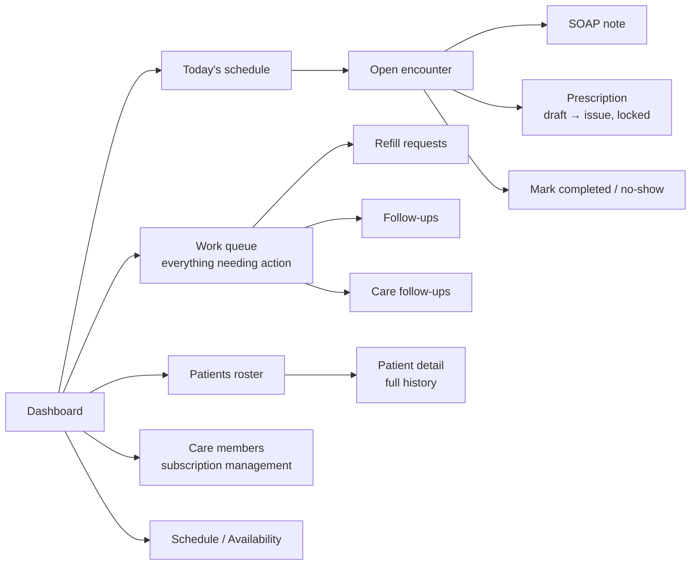

# MediFlow — Doctor Journey (Level 1: Architecture & UX)

Authored 2026-08-12. Stakeholder-level walkthrough of every doctor-facing
page in MediFlow, web and mobile. Companion to
[patient-journey.md](patient-journey.md); technical detail lives in
[doctor-technical.md](doctor-technical.md).

**Read this alongside a caveat up front, not buried at the end:** two
features described in the original Care subscription plan — the weekly
email digest and automatic medicine reminders — are **not actually active**
in the current build. The toggles exist on screen and the data is stored,
but nothing sends a digest or a reminder yet. Flagged here because a
stakeholder should hear it from this document, not discover it later.

## The whole doctor day, at a glance

## 1. Dashboard

**Purpose:** one screen, everything that needs the doctor's attention today
— never a sprawling analytics dashboard (an explicit product decision, not
an oversight).

**What's on it:** a setup checklist until specialty/availability/first
booking are done; five stat tiles (today/upcoming/completed/revenue/care
members); a six-tile "Needs your attention" summary (pending prescriptions,
unread messages, refills, follow-ups, care follow-ups, triage-flagged
visits) that's the doorway into the Work Queue; a "next patient" hero card
with a live countdown and join button; today's schedule list.

A sticky banner appears app-wide (both platforms) whenever a confirmed
appointment is imminent or in progress, so the doctor never has to
navigate back to Dashboard just to see it's almost time.

## 2. Work Queue

**Purpose:** the actual to-do list — six categories, each a count, each
one tap from resolving it.

**What's in it:** visits needing a prescription, unread messages, pending
refill requests, doctor-recommended follow-ups not yet booked, patient-
initiated care follow-ups, and triage-flagged visits needing a second look.

**Platform difference worth knowing:** on **web**, every category has
inline actions right there (decline a refill, mark a message read, snooze
or dismiss a follow-up, without leaving the page). On **mobile**, only
Care-plan follow-ups have inline actions — everything else is tap-through
into the relevant screen first. Same information, one extra tap on mobile
for most categories.

## 3. Schedule & Availability

**Purpose:** define working hours once, let the booking engine do the rest
— slots are computed live from these rules, never a separate calendar to
keep in sync.

**Platform difference worth knowing, and it's a real one:** on **web**,
the Schedule page is read-only (a week view plus a single "block this day"
toggle) — actually *editing* weekly hours happens on the Settings page. On
**mobile**, the Schedule screen *is* the editor: a first-time weekly-
template picker, a full hours-editor per weekday, and a "time off / one-off
extra clinic" exception sheet. If you're demoing availability setup,
mobile currently shows the richer experience.

## 4. Appointments

**Purpose:** the full list, today/upcoming/past, with search and status
filtering — mobile's filter set is more granular (adds Needs Rx and
Triage filters web doesn't have).

**Actions:** mark no-show, cancel (only where the cancellation window
allows it) — on **web** these live on this list; on **mobile** they live
on the Encounter screen instead (see below).

## 5. Encounter — the actual consult

**Purpose:** everything the doctor needs for one patient, one screen: who
they are, what they said at booking, their full history, and the tools to
document and prescribe — never a rushed context-switch mid-consult.

**What's on it:** a patient-identity strip with a "Returning patient"
badge and live presence indicator; a clinical snapshot (allergies,
conditions, current medicines, emergency contact) pulled from the
patient's medical profile so the doctor is never working blind; the
SOAP note editor (autosaves — no save button); the prescription composer;
a completion checklist; a follow-up recommendation (7/14/30 days, one
tap); the patient's full past-consultation and medicine history side by
side with the current visit.

**Platform difference:** on **mobile**, Complete/No-show/Cancel sit
directly on this screen. On **web**, those three live back on the
Appointments list — the encounter page itself only has "mark
completed"/"mark no-show", not cancel.

**Prescribing, specifically:** on **web**, the prescription composer is
inline on the encounter page. On **mobile**, prescribing is its own
dedicated screen, reached from the encounter — and it includes quick-start
templates (fever/cold, acidity, allergy) that pre-fill a draft, which the
web composer doesn't have. Once issued, a prescription is locked
permanently on both platforms — no edit path exists anywhere; a correction
is a new prescription on the next visit.

## 6. Patients

**Purpose:** the doctor's whole roster, searchable, with at-a-glance
signals for who needs attention.

**List:** search + filter (web: All/Members/Needs attention; mobile adds
Risk profile/Needs Rx/Follow-up/Refills/Unread/Reports/Upcoming — a
materially richer filter set).

**Detail:** visit count, clinical snapshot, a merged timeline of every
visit/report/follow-up/refill/message for that patient, medicine history,
Care-member status. "Start an async consult" (for a refill or check-in
without a live video call) is available from here on both platforms.

## 7. Refill Requests

**Purpose:** a lightweight lane for "I need more of what I was already
prescribed" — doesn't require booking a full new visit.

**How it's handled:** open an async consult (no live call — a
text-based review) and issue a fresh prescription, or decline with the
patient notified either way.

**Worth knowing:** this is available to *any* patient with an issued
prescription, whether or not they have a Care subscription — despite
sometimes being described as a Care benefit, nothing in the actual gating
requires one.

## 8. Follow-ups — three different things sharing similar names

Worth being precise about, since a stakeholder meeting is exactly where
this kind of ambiguity causes confusion:

1. **Doctor-recommended follow-ups** — the doctor taps "recommend a
   follow-up in 14 days" during an encounter; the patient sees a one-tap
   "book it" prompt on their Home screen. Not gated by Care.
2. **Refill requests** — covered above. Not gated by Care.
3. **Care follow-up credits** — the *patient's* one-per-month async
   check-in that comes with an active Care subscription. This is the only
   one of the three actually tied to the subscription.

All three surface together in the Work Queue as separate cards.

## 9. MediFlow Care — subscription management

**Purpose:** the doctor's side of the Care relationship — who's
subscribed, who needs a follow-up serviced, manual billing control (v1
has no automatic recurring charge — every activation is a doctor/admin
toggle, stated plainly in the product copy itself).

**What's on it:** subscriber count, per-patient status (Active / Trial /
Inactive / Cancelled), renewal date, follow-up-credit availability, and
controls to reset a credit, deactivate, or reactivate.

**Platform difference, and a real workflow gap:** on **web**, there's a
"Grant access" section for roster patients who have no subscription yet —
Grant trial or Activate. **On mobile, this doesn't exist.** A doctor can
manage *existing* subscribers from their phone, but can only start a
**brand-new** patient's Care subscription from the web app.

**The two features described in the original plan that aren't live yet:**
the weekly digest email and the automatic medicine-reminder notifications.
The preference toggles for both exist and save correctly — they just don't
trigger anything downstream today. Also worth knowing: an active
subscription's monthly period doesn't automatically roll over on its own
yet — once a period lapses, it stays lapsed until a doctor manually
reactivates it, or the patient resubscribes.

## 10. Messages

Same conversation thread as the patient side, doctor's view. One
structural note: a doctor's conversation list only ever shows patients
with an *active* Care subscription — a lapsed or never-subscribed patient
simply doesn't appear in the doctor's inbox, by design, not as a filter
the doctor has to apply.

## 11. Settings

**Purpose:** doctor profile — specialty, bio, consultation fee, Care plan
price, slot length, timezone, weekly availability rules, date overrides.

**Platform difference, and a real one:** **mobile's** settings screen
edits every field the profile supports, including the trust/credentialing
fields planned for the future multi-doctor marketplace (photo, degree,
registration number, years of experience, languages spoken). **Web's**
settings form only exposes specialty/bio/fee/Care-price/slot-length/
timezone — the credentialing fields aren't editable from web today, even
though the doctor record supports them.
