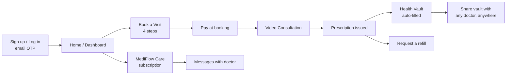

# MediFlow — Patient Journey (Level 1: Architecture & UX)

Authored 2026-08-12. Stakeholder-level walkthrough of every patient-facing
page in MediFlow, web and mobile, in the order a real patient encounters
them. No API names, no database tables — that's the companion document,
[patient-technical.md](patient-technical.md). This one is for a room deciding
whether the product *works*, not how it's built.

Companion docs: [doctor-journey.md](doctor-journey.md) (the other side of
every interaction), [doctor-technical.md](doctor-technical.md).

## How to read this

Each page is one section: what it's for, what's actually on it, and a short
scenario showing it in use. Where mobile and web differ, it's called out
inline — otherwise assume both look and behave the same.

## The whole journey, at a glance



## 1. Sign up / Log in

**Purpose:** get in the door with the least possible friction — no
passwords, ever, for the primary path.

**What's on it:** an email field, then a 6-digit code field. That's the
entire screen. A new email becomes a patient account automatically the
first time it verifies — there is no separate "create account" step.

**Scenario:** Priya has never used MediFlow. She types her email, gets a
code by email within seconds (in production; instantly-visible in dev), types
it in, and is on her Home screen. Total time: under a minute, zero
passwords chosen or remembered.

**Mobile note:** identical flow, native screens (`(auth)/login`,
`(auth)/verify`) instead of a web form, session held in the device's secure
storage (Keychain/Keystore) instead of a browser cookie.

**Web-only detail:** an optional "Sign in with Google" button appears when
the clinic has configured it — never on the doctor login page, only patient.

## 2. Home / Dashboard

**Purpose:** the one screen a returning patient actually needs — what's
next, and three or four cards for everything else, never a sprawling
dashboard.

**What's on it, in order:**
- A hero card: next upcoming appointment (or a "Book your first visit"
  prompt if there is none), with a live join button that activates 10
  minutes before the call.
- A profile-completion nudge if the medical profile isn't filled in yet.
- **MediFlow Care** card — subscribed or not, shows plan status and the
  right call to action either way (§9).
- **Health Vault** card — record count, one tap to the vault (§8).
- A doctor-recommended follow-up prompt, if one exists, with a one-tap
  "book it" action.
- Active medicines, pulled from the most recent issued prescription.

**Scenario:** Priya opens the app three weeks after her last visit. Home
shows her next follow-up is due, her vault already has last visit's
prescription in it, and a small badge shows the doctor replied to a message
she sent about a side effect.

## 3. Book a Visit

**Purpose:** the core conversion moment — this is where "curious visitor"
becomes "paying, committed patient." Every design decision here is about
removing reasons to abandon partway through.

**Four steps, one continuous flow:**
1. **Intake** — pick a visit reason from a short list, describe symptoms in
   free text, optionally attach a photo/PDF of a report right now. A
   deterministic check flags emergency-sounding symptoms and shows an
   urgent-care warning before anything else proceeds.
2. **Slot** — pick a date, see genuinely free slots (computed live, never a
   stale cached list), pick one. The slot is held for 10 minutes the moment
   it's picked — nobody else can take it while payment is in progress.
3. **Payment** — pay the fee now, not after the consult. This is the
   deliberate fix for the no-show problem: a patient who's already paid
   shows up.
4. **Confirmation** — booking summary, calendar-add option, and (if the
   patient closes the tab mid-flow) the flow resumes exactly where they left
   off on return, keyed to the appointment already created.

**Scenario:** Rahul has a sore throat. He picks "New symptom," types two
sentences, uploads a photo of his throat, picks tomorrow 6pm, pays ₹500, and
is booked — under three minutes, no phone call to a receptionist required.

## 4. Appointments

**Purpose:** every visit, past and upcoming, one place — and the controls
to change plans without calling anyone.

**List view:** upcoming and past, split clearly, with status shown in plain
language (never a raw system status word).

**Detail view, per appointment:**
- Countdown to the visit, join button (enabled only in the real join
  window).
- Reschedule (pick a new free slot) or cancel (free up to 2 hours before
  start; the app is explicit about the cutoff before the patient commits).
- After the visit: the prescription, if issued, shown inline.
- A link to the payment receipt.

**Scenario:** Rahul's plans change. He opens the appointment, taps
Reschedule, picks a new slot two days later — no phone call, no email back
and forth.

## 5. Video Consultation

**Purpose:** the actual visit. One goal: feel as close to being in the room
as a phone screen allows.

**What happens:** a pre-join screen checks camera and microphone before
entering the room. The join button is genuinely disabled outside the real
window (10 minutes before to 30 minutes after the scheduled time) — no
confusing "waiting for doctor" limbo outside that window.

**Scenario:** at 5:55pm, five minutes before Rahul's slot, the join button
lights up. He checks his camera, joins, and by 6:00pm is talking to the
doctor.

## 6. Prescriptions

**Purpose:** every medicine ever prescribed, permanently — the single
biggest complaint about paper prescriptions ("I lost it") solved by simply
never handing over a piece of paper that can be lost.

**What's on it:** every issued prescription, newest first — diagnosis,
each medicine with its schedule ("Morning, Night · after food · 5 days"),
doctor's advice, and a **Request refill** button per prescription.

**Scenario:** Rahul finishes his 5-day course, feels fine, doesn't think
about it again until three months later when the same thing recurs. He
opens Prescriptions, finds the old one in ten seconds, and requests a
refill instead of re-explaining his whole history to a new pharmacist.

## 7. Refills

**Purpose:** a lightweight way to ask for more of something already
prescribed, without booking a full new visit for a routine continuation.

**What happens:** tapping "Request refill" on an issued prescription creates
a pending request the doctor sees in their work queue; the doctor fulfills
it through a quick async review (§ doctor-journey.md) or declines it with a
reason.

## 8. Health Vault

**Purpose:** the patient's whole medical history, portable to any doctor,
not locked inside MediFlow.

**What's on it:**
- A timeline of every record — auto-filled from MediFlow visits, plus
  anything the patient has added from an old doctor — newest first, each
  tagged with its source ("From your MediFlow visit" vs. "Added by you").
- **Share my vault** — pick what to share (everything, or just the last 6
  months) and for how long (2 hours, 24 hours, 7 days), confirm with a
  one-time code sent to the patient's own email, get a short share code.
  Read that code to any doctor, anywhere — they open a link, type the code,
  see exactly the scoped history, no MediFlow account needed on their end.
  Revocable at any time; every view is logged back to the patient.
- **Add an old record** — photograph or upload a PDF of a prescription or
  report from any other doctor, review/correct what was read from it (never
  auto-trusted), save it into the vault in MediFlow's own structured format.

```mermaid
sequenceDiagram
    participant P as Patient
    participant M as MediFlow
    participant D as Any Doctor (no account)
    P->>M: Share my vault (scope + duration)
    M->>P: One-time code, emailed
    P->>M: Confirms code
    M->>P: Short share code + link
    P->>D: Reads code aloud / sends link
    D->>M: Opens link, enters code
    M->>D: Scoped, time-limited, read-only view
    Note over P,M: Patient can revoke anytime;<br/>every view logged back to patient
```

**Scenario:** Priya is traveling and needs to see a doctor she's never met.
She opens her vault, taps Share, picks "last 6 months," confirms with the
code emailed to her, and reads the resulting 8-character code to the
receptionist. The new doctor opens a link on their own laptop, types the
code, and has Priya's real prescription history in under a minute — without
ever hearing of MediFlow before that day.

**Mobile vs. web:** identical feature set, reached via a "Health Vault" card
on Home on both platforms; the receiving-doctor page (`/vault/view`) is
necessarily a plain web page either way, since that doctor has no app.

## 9. MediFlow Care (subscription)

**Purpose:** the relationship *between* visits, not just during them —
messaging, a monthly async check-in, reminders — sold as an ongoing plan,
not bundled into the one-off consult fee.

**What's on it:** a calm status card (not a sales banner) — unsubscribed
patients see the benefits and a "Start care plan" button; subscribed
patients see their renewal date, whether their monthly follow-up credit is
still available, and a direct line to Message doctor.

**Always visible:** "Messaging is not for emergencies" — on every surface
that promotes this feature, without exception.

**Scenario:** Priya subscribes after her first visit for ₹499/month. Two
weeks later she has a quick question about a side effect — instead of
booking a whole new paid consult, she messages the doctor directly.

## 10. Messages

**Purpose:** the actual messaging surface Care unlocks.

**What's on it:** a conversation with the doctor, live delivery when both
are online, read receipts, image/PDF attachments. Locked behind an active
Care subscription — a one-off paid consult does not unlock it.

## 11. Medical Profile & Settings

**Medical profile:** date of birth, gender, blood group, allergies, chronic
conditions, current medications, emergency contact — surfaced to the doctor
automatically before every consult so they're never working blind. A
completion nudge appears on Home until this is filled in.

**Settings:** name, email, password (web only — mobile has no password
change UI), sign-out, Care preferences (digest/reminders), and (mobile) a
support-request path for account deletion, explicitly routed to human
review rather than a self-service delete button, since medical-record
retention needs clinic judgment, not a client-side toggle.

## 12. Receipt

**Purpose:** a printable proof-of-payment per visit — plain, read-only, no
actions beyond viewing/printing (web) or viewing (mobile, no print API on
device).
